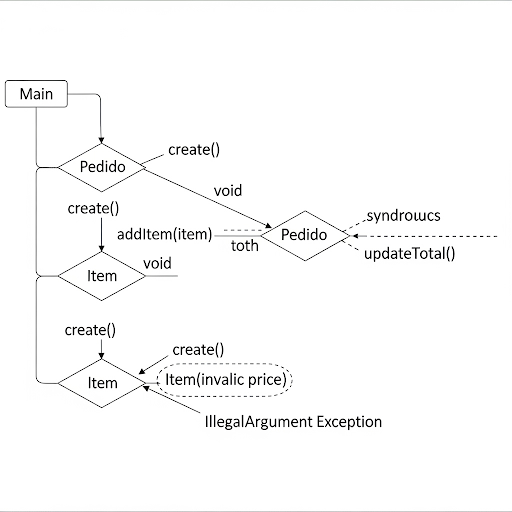

# 🛠️ Proyecto: Encapsulación en Java (con validaciones)

Este proyecto demuestra el uso de la **encapsulación** en Java, con un ejemplo práctico de un sistema de **Pedidos** e **Items**, ahora mejorado con **validaciones internas** para proteger aún más la lógica del negocio.

## 📂 Estructura del proyecto
```
ProyectoEncapsulacion/
 ├─ src/
 │   └─ com/
 │       └─ ejemplo/
 │           ├─ Main.java
 │           ├─ Pedido.java
 │           └─ Item.java
 └─ README.md
```

## 📌 Mejoras aplicadas
- ✅ Encapsulación de datos → todos los atributos son `private`.
- ✅ Encapsulación de comportamiento → la lógica de negocio (`agregarItem`) está dentro de la clase `Pedido`.
- ✅ Validaciones internas:
  - `Item` no puede tener nombre vacío ni precio negativo.
  - `Pedido` no puede crearse sin cliente ni aceptar ítems nulos.
- ✅ Colecciones inmutables → `getItems()` devuelve una copia segura de la lista.

## 📜 Código principal

### `Item.java`
```java
package com.ejemplo;

public class Item {
    private String nombre;
    private double precio;

    public Item(String nombre, double precio) {
        if (nombre == null || nombre.isBlank()) {
            throw new IllegalArgumentException("El nombre del item no puede estar vacío.");
        }
        if (precio <= 0) {
            throw new IllegalArgumentException("El precio del item debe ser mayor que cero.");
        }
        this.nombre = nombre;
        this.precio = precio;
    }

    public String getNombre() {
        return nombre;
    }

    public double getPrecio() {
        return precio;
    }
}
```

### `Pedido.java`
```java
package com.ejemplo;

import java.util.ArrayList;
import java.util.List;

public class Pedido {
    private String cliente;
    private double valorTotal;
    private List<Item> items;

    public Pedido(String cliente) {
        if (cliente == null || cliente.isBlank()) {
            throw new IllegalArgumentException("El nombre del cliente no puede estar vacío.");
        }
        this.cliente = cliente;
        this.items = new ArrayList<>();
        this.valorTotal = 0.0;
    }

    public void agregarItem(Item item) {
        if (item == null) {
            throw new IllegalArgumentException("El item no puede ser nulo.");
        }
        this.items.add(item);
        this.valorTotal += item.getPrecio();
    }

    public String getCliente() {
        return cliente;
    }

    public double getValorTotal() {
        return valorTotal;
    }

    public List<Item> getItems() {
        return List.copyOf(items); // copia inmutable
    }
}
```

### `Main.java`
```java
package com.ejemplo;

public class Main {
    public static void main(String[] args) {
        try {
            Pedido pedido = new Pedido("Luis");

            pedido.agregarItem(new Item("Manzanas", 10.5));
            pedido.agregarItem(new Item("Naranjas", 8.0));
            pedido.agregarItem(new Item("Peras", 12.0));

            // Intento inválido
            pedido.agregarItem(new Item("Fruta inválida", -5.0));

            System.out.println("Cliente: " + pedido.getCliente());
            System.out.println("Total del pedido: " + pedido.getValorTotal());

        } catch (IllegalArgumentException e) {
            System.out.println("⚠️ Error: " + e.getMessage());
        }
    }
}
```

## ▶️ Cómo compilar y ejecutar
```bash
javac src/com/ejemplo/*.java -d out
java -cp out com.ejemplo.Main
```

## ✅ Salida esperada
```
⚠️ Error: El precio del item debe ser mayor que cero.
```

## 📊 Diagrama UML de clases
- `Pedido` contiene una lista de `Item`  
- `Main` usa a `Pedido` y `Item` para ejecutar el flujo  


## 📈 Diagrama UML de secuencia
1. `Main` crea un `Pedido`
2. `Main` agrega ítems válidos (`Item`)
3. `Pedido` actualiza el total automáticamente
4. `Main` intenta agregar ítem inválido
5. Se lanza excepción con mensaje de validación




## 🎯 Beneficios de esta versión
- El estado del sistema siempre es válido gracias a las validaciones internas.
- Se evita lógica repetida en `Main`, concentrando reglas dentro de las clases correspondientes.
- El diseño es robusto, mantenible y seguro.

## Fuente:
https://www.aluracursos.com/blog/revisando-la-orientacion-a-objetos-encapsulacion-de-java

